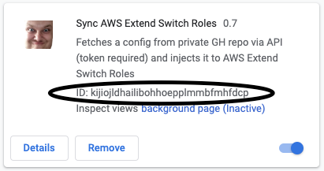

## Intro

We find the [AWS Extend Switch Roles](https://github.com/tilfin/aws-extend-switch-roles) extension considerably helpful. A must-have for everyone using many AWS accounts and IAM roles.

The only missing piece for this great extension is: how to manage the `Roles` configuration and how to sync it to many different users, assuming there is a team of people working on the same - ever changing Roles config.

Apparently we are not the only team that wanted this missing functionality badly:
- https://github.com/tilfin/aws-extend-switch-roles/issues/39
- https://github.com/tilfin/aws-extend-switch-roles/issues/107

Fortunately, the original AESR extension Author decided to help the community allowing to send the config from another extension:
- https://github.com/tilfin/aws-extend-switch-roles/wiki/External-API#config-sender-extension

This extension is the missing piece (at least to some extent).

Although it would probably be easier to simply download a raw file from S3 or another easily accessible endpoint, we prefer to control the version of the `roles.txt` file and keep it fairly secure.

That's why we decided to store it in a private Github repo ([and yeah - everyone can have it for free](https://github.blog/2019-01-07-new-year-new-github/))

The extension supports the background sync, on-demand sync, and notifications.

**NOTE:**

it's an extension to the extension, meaning ***sync-aws-extend-switch-roles*** is *NOT* a replacement but it injects some data into **AWS Extend Switch Roles**

It's not perfect, there are plenty of ideas on how to improve it, but it does the job in its current shape and we've decided to share it with the broader community.

A great thanks to [tilfin](https://github.com/tilfin) for creating the AWS Extend Switch Roles!

## Get
- [Chrome Web Store](https://chrome.google.com/webstore/detail/sync-aesr/kijiojldhailibohhoepplmmbfmhfdcp)

## Set up
- the `Face` icon represents one of our colleagues - please do not find it scary - he just wants to be famous :-)
- right-click the  icon (in the top-right corner), choose `'Options'`
- `Configuration URL`
  - [Get contents path API docs](https://developer.github.com/v3/repos/contents/#get-contents): [https://api.github.com/repos/:owner/:repo/contents/:path](https://api.github.com/repos/:owner/:repo/contents/:path)
  - example: `https://api.github.com/repos/netguru/sync-aws-extend-switch-roles/contents/data/roles.txt`
    - this particular repo is publicly available, please consider it just an example
  - **NOTE**: `api.github.com` URLs are not equal to `github.com` URLs
- `Github Token` [Set one at https://github.com/settings/tokens] (Select scopes: `repo` [`Full control of private repositories` - there is no read-only mode unfortunately])
- `Target Extension ID` [AESR extension ID: `jpmkfafbacpgapdghgdpembnojdlgkdl`]
  - do not confuse with SYNC_AESR_EXT_ID
- `Auto-refresh in background (every 15min)` (optional)
- NOTE: you need to reload the extension after this setup for the options to take effect in the background process

- choose  icon (Configuration/Options)
- on the settings page, under `Extension API`
  - `Config sender extension ID: `
    - provide the `SYNC_AESR_EXT_ID` (default: `kijiojldhailibohhoepplmmbfmhfdcp`)
- debug:
- background script console
  - url available at `chrome://extensions` under `Inspect views background page`
- manual trigger/popup console
  - url available at: click the SYNC_AESR icon, the `refresh` button will pop up
    - right click on the button, choose `Inspect` (and go to `Console`)

## Develop
I want to modify something

### Chrome extensions dev info
- https://developers.chrome.com/extensions
- https://developer.chrome.com/extensions/manifest

### How to set it up for local development
- install [AWS Extend Switch Roles](https://github.com/tilfin/aws-extend-switch-roles)
- go to `chrome://extensions`
- turn on `Developer mode` in the top-right corner | **IMPORTANT**
- click `Load unpacked` in the top-left corner at `chrome://extensions` and choose `dist/` dir content
- it'll be assigned an ID (aka `SYNC_AESR_EXT_ID`) [`ajgjkeponjcjicdpgmeieipaikgnplde`]
  - should look like this:
  - 
